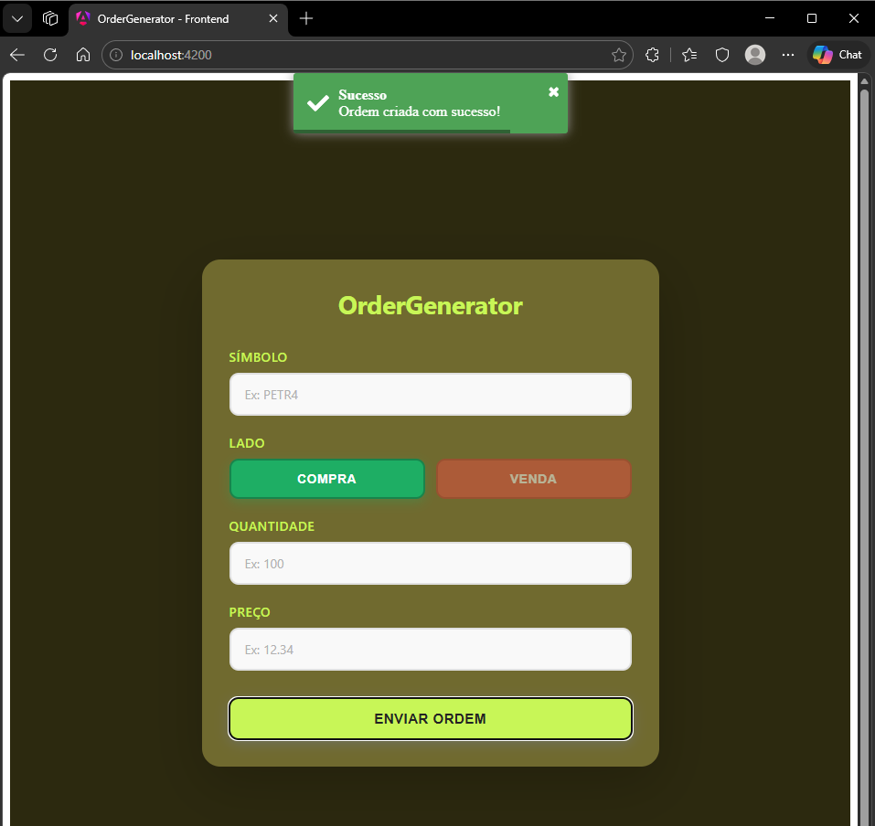
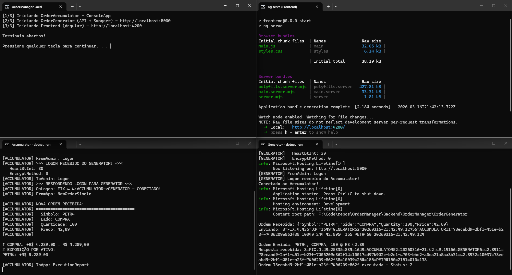

# Order Manager

Solução composta por três aplicações principais que se comunicam usando o protocolo FIX na versão 4.4 (lib do QuickFix disponível em https://quickfixn.org/):

## Tecnologias Utilizadas

- **Backend**: .NET 10, C# 14
- **Protocolo**: FIX 4.4 (QuickFixN)
- **Frontend**: Angular 21, TypeScript, Node.js 24
- **Containerização**: Docker & Docker Compose

## Fluxo de Comunicação

```
Frontend (Angular)
    ↓
OrderGenerator (API REST - C#)
    ↓
FIX Protocol 4.4
    ↓
OrderAccumulator (FIX Server - C#)
    ↓
Exposição calculada e exibida no Console
```

## Componentes do Projeto

### OrderGenerator

API REST que expõe endpoints para o frontend. Possui validações sobre os campos do formulário e a lógica para criação e envio de ordens para o QuickFix Engine (NewOrderSingle).

- Validação de campos:
  - **Símbolo**: Deve ser necessariamente PETR4, VALE3 ou VIIA4
  - **Lado**: COMPRA ou VENDA
  - **Quantidade**: 1 até 99.999
  - **Preço**: Múltiplo de 0,01, máximo 999,99

- A aplicação registra no log todas as ordens recebidas

- Em caso de ordens **INVÁLIDAS**, os erros de validação são exibidos no Console da aplicação e também são retornados para o Frontend, para exibição na tela

- Ordens **VÁLIDAS** seguem para envio ao QuickFix para serem contabilizadas pelo **OrderAccumulator**

### OrderAccumulator

Aplicação de Console com Servidor QuickFix que recebe ordens do OrderGenerator

- Calcula exposição financeira consolidada por símbolo

- Ordens de **COMPRA** devem aumentar a exposição
- Ordens de **VENDA** devem diminuir a exposição

### Frontend

- Formulário para criação de ordens
- Toats com informações sobre o Envio de Ordens (Validações ou Confirmação de Envio com sucesso)



## Estrutura do Projeto

```
OrderManager/
│
├── Backend/
│   └── OrderManager
│       ├── OrderGenerator/
│       ├── OrderAccumulator/
│       └── OrderManager.slnx
│
├── Frontend/
│   ├── src
│   │   └── app/
│   └── package.json
│
├── docker-compose.yml
├── README.md
├── start-local.bat
└── start-local.sh
```

## Executando Localmente

Para execução local é necessário a instalação do ".NET 10 SDK" e "Node.js 24".

Na pasta raiz do projeto, OrderManager, executar os seguintes comandos:

1. Executar OrderAccumulator

```
cd Backend/OrderManager/OrderAccumulator
dotnet run
```

2. Executar OrderGenerator

```
cd Backend/OrderManager/OrderGenerator
dotnet run
```

A API estará disponível em: http://localhost:5000/swagger

3. Frontend

```
cd Frontend
npm install
npm start
```

O frontend estará disponível em: http://localhost:4200

⚠️ **PS:** É necessário iniciar o OrderAccumulator antes do OrderGenerator para que a conexão entre eles seja feita instantaneamente. Caso contrário, uma nova tentativa de conexão será feita após um curto intervalo (No próximo Heartbeat, por padrão a cada 30 segundos).

### Scripts 'start-local'

Esse passo a passo está resumido no script start-local.bat (Windows) e no script start-local.sh (Linux). Os scripts estão configurados para iniciar 3 terminais separados, um para cada componente da solução.



## Execução com Docker Compose

Na raiz do projeto, na pasta OrderManager, executar:

```
# Inicialização dos dockerfiles
docker-compose up -d

# Logs de todos os serviços
docker-compose logs -f

# Logs específicos
docker-compose logs -f order-accumulator
docker-compose logs -f order-generator
docker-compose logs -f frontend
```

## Exemplo de Uso

1. Abra http://localhost:4200 no navegador
2. Na aba "Nova Ordem", preencha os campos:
   - Símbolo: PETR4
   - Lado: COMPRA
   - Quantidade: 1000
   - Preço: 25.50
3. Clique em "Enviar Ordem"
4. Acesse a aba "Exposição" para visualizar a exposição financeira

## Cálculo de Exposição

Para cada símbolo:

```
Exposição = (Σ Preço × Quantidade COMPRA) - (Σ Preço × Quantidade VENDA)
```

**Exemplo:**

- COMPRA: 100 unidades @ 25,50 = R$ 2.550,00
- COMPRA: 50 unidades @ 26,00 = R$ 1.300,00
- VENDA: 30 unidades @ 25,75 = R$ 772,50

Exposição = (2.550 + 1.300) - 772,50 = **R$ 3.077,50**

---

This is a challenge by [Coodesh](https://coodesh.com/)
